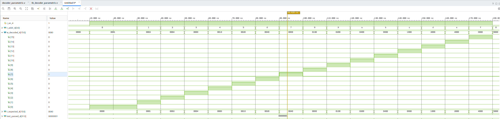
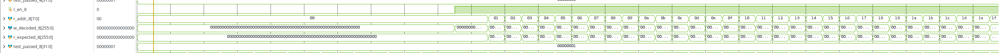
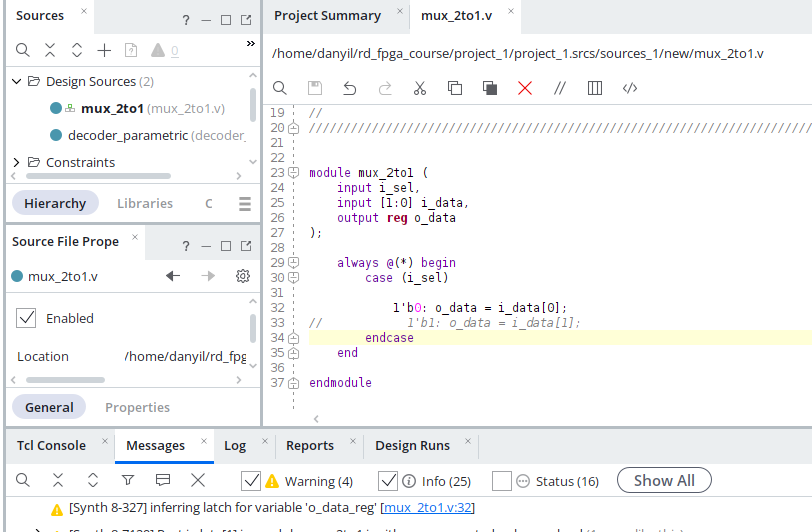
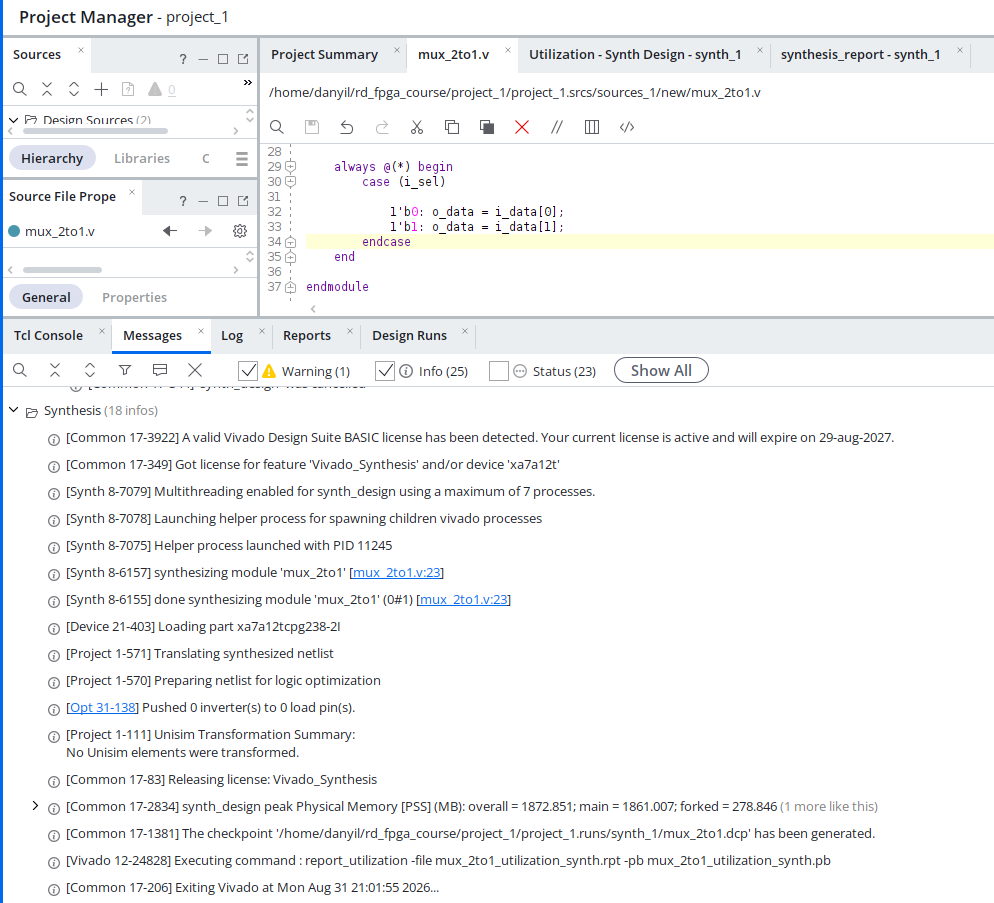
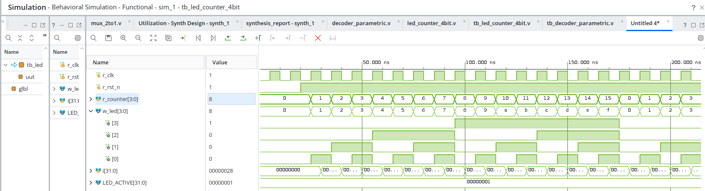

# Домашнє завдання №1 — Verilog/SystemVerilog для синтезу

**Для всіх завдань треба створити RTL проект в Vivado (Quartus
якщо у вас Altera) і створити verilog (VHDL) file.
Запусити функціональну симуляцію і задати для кожного входу 
сигнали (0, 1, clock) в режимі Force. Тобто тестбенч не пишете.
Проекти, файли, а також скріни симуляції скидуєте на git, 
посилання мені на перевірку**

---

**1. НАПИСАТИ МОДУЛЬ ПАРАМЕТРИЗОВАНОГО ДЕШИФРАТОРА**

Написати модуль decoder з параметром WIDTH (наприклад,
за замовчуванням WIDTH=4), що перетворює код на вході
в один активний вихід серед WIDTH.

---
> 🔵 **Відповідь**
>
> [VERILOG CODE](project_1/project_1.srcs/sources_1/new/decoder_parametric.v)


Просимулювати в XSim з кількома різними значеннями входу
й перевірити на waveform, що активним стає саме очікуваний
вихід.

Інстанціювати той самий модуль двічі в тестовому оточенні —
один раз із WIDTH=4, другий раз із WIDTH=8 (чи іншим значенням)
— підтвердити, що один і той самий код працює для обох
розрядностей без змін.

---
> 🔵 **Відповідь**
>
> [VERILOG TB](project_1/project_1.srcs/sim_1/new/tb_decoder_parametric.v)
> 
> Декодер 4 біт
> 
> 
> Декодер 8 біт в симуляції
> 
> 
> **Результат**:    
> ```
> <===================== TEST RESULTS ==================== >
> Test for WIDTH=4 PASSED
> Test for WIDTH=8 PASSED
> ```
>
>---

---

**2. ЗНАЙТИ Й ВИПРАВИТИ НЕНАВМИСНИЙ LATCH**

Написати always_comb блок із НАВМИСНО неповним case (без
default) — наприклад, простий мультиплексор 2-в-1, де
описано тільки один із двох можливих варіантів sel.

Синтезувати модуль у Vivado (Run Synthesis) і зафіксувати
попередження синтезатора про Latch (текст попередження
з Synthesis Report чи Message View, у звіті чи скріншотом).

Виправити код, додавши default (чи else, якщо це if/else),
повторно запустити синтез і підтвердити, що попередження
зникло.

Для перевірки також можна провести симуляцію  Latch, але це
необов'язково.

---
> 🔵 **Відповідь**
> 
> [VERILOG CODE](project_1/project_1.srcs/sources_1/new/mux_2to1.v)
> 
> Warning LATCH
> 
> 
> Latch remove:
>

---

**3. НАПИСАТИ МОДУЛЬ ЛІЧИЛЬНИКА, ЩО ВИВОДИТЬ ЧИСЛО В ПАТЕРН НА LED** 

Написати модуль 4-бітного лічильника, що на кожному такті 
синхронізації (clock) збільшує своє значення на 1 
(від 0 до 15, потім знову з 0) і виводить поточне значення на 
4-бітний патерн для LED — кожен LED відповідає одному 
розряду двійкового запису числа. Передбачити вхід reset, 
що обнуляє лічильник. Просимулювати в XSim, перевірити 
на waveform, що лічильник коректно рахує 0→1→2→...→15→0 
і що патерн на LED відповідає двійковому запису кожного значення.

---
> 🔵 **Відповідь**
> 
> [VERILOG CODE](project_1/project_1.srcs/sources_1/new/led_counter_4bit.v)
> 
> 
>
> Лічильник ракує коректно, патерн LED відповідає двійковому запису кожного значення
> 
---