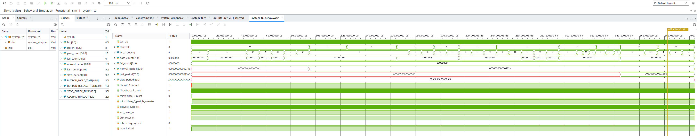

# ДОМАШНЄ ЗАВДАННЯ ПІСЛЯ ЛЕКЦІЇ 10
## ЗАВДАННЯ 1. ZYNQ PS

Створити проект у Vivado.
Зібрати Block Design: 
- Zynq PS
- AXI GPIO (LED, кнопки, перемикачі)
- AXI Timer.

Реалізувати "біжучу доріжку" на світлодіодах:
- Один запалений LED переміщується по колу (LED0 → LED1 → LED2 →
  LED3 → LED0 → ...)
- Швидкість переміщення визначає AXI Timer (не програмна затримка
  циклом)
- Один перемикач обирає напрямок руху (вперед/назад)
- Кнопки змінюють швидкість руху/зупиняють/поновлють рух

## ЗАВДАННЯ 2. MICROBLAZE

Той самий Block Design, той самий функціонал, та сама логіка коду —
але з MicroBlaze замість Zynq PS.
Написати тестбенч для цього проекту з натисканням кнопок.
Симулювати проект з реальним .elf файлом згенерованим у Vitis.

## Що треба зробити
Або перше або друге завдання треба перевірити на реальному залізі, 
якщо є така можливість.

## Що треба здати

Для кожного із двох завдань ОБОВ'ЯЗКОВО залити на git наступне:
- Файли Vivado проекту. 
- Файли Vitis проекту.
Для заливки на git використовувати .gitignore з кореня \git\robot-dreams-code\FPGA\
- Результат: відео/скріншот реального заліза, або логи зібраних проектів Vitis
- Скріншот Waveform із симуляції проекту Microblaze

>> Коли взявся робити ДЗ, пропустив момент, що перемикач (а не кнопка) має обирати напрямок руху. 
>> Я зробив на кнопках все керування, а коли став заповнювати звіт, то побачив, що не додивився

### Microblaze

[Vitis Project](vitis/microblaze)
[Vivado Project](vivado/microblaze)

Simulation



>> ```LOG
>> [13646.000 ns] Firmware boot detected: LED0 active
>> [13646.000 ns] PASS: LED = 0001
>> 
>> --- Checking forward LED cycle ---
>> [44716.000 ns] PASS: LED changed to 0010
>> [54756.000 ns] PASS: LED changed to 0100
>> [64766.000 ns] PASS: LED changed to 1000
>> [74726.000 ns] PASS: LED changed to 0001
>> 
>> --- Measuring normal speed ---
>> [94826.000 ns] Measured LED period = 10010.000 ns
>> 
>> --- BTN0: STOP ---
>> [94826.000 ns] Pressing BTN0
>> [165026.000 ns] PASS: LED remained stopped at 0100
>> 
>> --- BTN0: START ---
>> [165026.000 ns] Pressing BTN0
>> [215056.000 ns] PASS: running light resumed: 0100 -> 1000
>> 
>> --- BTN1: CHANGE DIRECTION ---
>> [215056.000 ns] Pressing BTN1
>> 
>> --- Checking reverse LED cycle ---
>> [265156.000 ns] PASS: LED changed to 0100
>> [275166.000 ns] PASS: LED changed to 0010
>> [285196.000 ns] PASS: LED changed to 0001
>> [295156.000 ns] PASS: LED changed to 1000
>> 
>> --- BTN2: FASTER ---
>> [295156.000 ns] Pressing BTN2
>> [344636.000 ns] Measured LED period = 5030.000 ns
>> [344636.000 ns] PASS: faster period 5030.000 ns < normal period 10010.000 ns
>> 
>> --- BTN3: SLOWER ---
>> [344636.000 ns] Pressing BTN3
>> [404046.000 ns] Measured LED period = 9950.000 ns
>> [404046.000 ns] PASS: slower period 9950.000 ns > fast period 5030.000 ns
>> 
>> ========================================
>>  TEST SUMMARY
>> ========================================
>>  PASS: 13
>>  FAIL: 0
>>  RESULT: ALL TESTS PASSED
>> ```

---

### Zynq
[Vitis Project](vitis/zynq)
[Vivado Project](vivado/zynq)

Лог збірки програми
```LOG
 --------------------------------------------------------------------------------
 --------------------------------------------------------------------------------
 [25.09.2026, 11:09:47]: Build for led_controller_arm::build with id '28b8be41-f85b-4797-bb15-d400d52e32fc' started.
 --------------------------------------------------------------------------------
 Command: bash -c unset CC CXX ;empyro build_app -s /home/danyil/rd_fpga_course/lesson_10/vitis/zynq/led_controller_arm/src -b /home/danyil/rd_fpga_course/lesson_10/vitis/zynq/led_controller_arm/build
 The log will be written to the file: /home/danyil/rd_fpga_course/lesson_10/vitis/zynq/led_controller_arm/build/build.log
 [INFO]: Starting Application build process
 [INFO]: Building Application
 [1/3] ==========Application Build Information ==========

Compiler Flags:  -DSDT -mcpu=cortex-a9 -mfpu=vfpv3 -mfloat-abi=hard  -MMD -MP -specs=/home/danyil/rd
_fpga_course/lesson_10/vitis/zynq/pynq_z2_arm_platform/export/pynq_z2_arm_platform/sw/standalone_ps7
_cortexa9_0/Xilinx.spec -I/home/danyil/rd_fpga_course/lesson_10/vitis/zynq/pynq_z2_arm_platform/expo
rt/pynq_z2_arm_platform/sw/standalone_ps7_cortexa9_0/include -Wall -Wextra      -O0  -g3     -U__cla
ng__  

Linker Flags:       -Wl,-T -Wl,"/home/danyil/rd_fpga_course/lesson_10/vitis/zynq/led_controller_arm/
src/lscript.ld" -L"/home/danyil/rd_fpga_course/lesson_10/vitis/zynq/led_controller_arm/src/" -L"/hom
e/danyil/rd_fpga_course/lesson_10/vitis/zynq/pynq_z2_arm_platform/export/pynq_z2_arm_platform/sw/sta
ndalone_ps7_cortexa9_0/lib/" -L"/" -Wl,--start-group,-lxilstandalone,-lxiltimer,-lxil,-lgcc,-lc -Wl,
--end-group

===========================================
[2/3] Building C object CMakeFiles/led_controller_arm.elf.dir/main.c.obj
[3/3] Linking C executable led_controller_arm.elf
   text	   data	    bss	    dec	    hex	filename
  30844	   1728	  23032	  55604	   d934	led_controller_arm.elf
 Build Finished successfully
 --------------------------------------------------------------------------------
[25.09.2026, 11:09:54]: Build for led_controller_arm::build with id '28b8be41-f85b-4797-bb15-d400d52e32fc' ended.
```

Лог збірки платформи

```LOG
 --------------------------------------------------------------------------------
 --------------------------------------------------------------------------------
 [25.09.2026, 11:08:44]: Generate pynq_z2_arm_platform platform with id 'd17993ca-ebcc-40da-9fb7-d566d8b4c480' started.
 --------------------------------------------------------------------------------
 The log will be written to the file: /home/danyil/rd_fpga_course/lesson_10/vitis/zynq/pynq_z2_arm_platform/logs/standalone_ps7_cortexa9_0_build.log
 The log will be written to the file: /home/danyil/rd_fpga_course/lesson_10/vitis/zynq/pynq_z2_arm_platform/logs/zynq_fsbl_build.log
 -- Configuring done (0.9s)
-- Generating done (0.5s)
-- Build files have been written to: /home/danyil/rd_fpga_course/lesson_10/vitis/zynq/pynq_z2_arm_platform/ps7_cortexa9_0/standalone_ps7_cortexa9_0/bsp/libsrc/build_configs/gen_bsp
[INFO]: Building BSP
 -- Configuring done (0.7s)
-- Generating done (0.5s)
-- Build files have been written to: /home/danyil/rd_fpga_course/lesson_10/vitis/zynq/pynq_z2_arm_platform/zynq_fsbl/zynq_fsbl_bsp/libsrc/build_configs/gen_bsp
 [INFO]: Building BSP
 [1/155] ========== BSP Build Information ==========

Compiler PATH: /home/amd/2026.1/Vitis/gnu/aarch32/lin/gcc-arm-none-eabi/bin/arm-none-eabi-gcc

Compiler FLAGS:  -DSDT -mcpu=cortex-a9 -mfpu=vfpv3 -mfloat-abi=hard  -MMD -MP -specs=/home/danyil/rd
_fpga_course/lesson_10/vitis/zynq/pynq_z2_arm_platform/ps7_cortexa9_0/standalone_ps7_cortexa9_0/bsp/
Xilinx.spec -I/home/danyil/rd_fpga_course/lesson_10/vitis/zynq/pynq_z2_arm_platform/ps7_cortexa9_0/s
tandalone_ps7_cortexa9_0/bsp/include  -O2 -g -Wall -Wextra -fno-tree-loop-distribute-patterns -DNDEB
UG

===========================================
** The above flags are BSP level flags. Increase verbosity to see component specific flags **
===========================================
[2/155] Building C object libsrc/standalone/src/CMakeFiles/xilstandalone.dir/xcortexa9_g.c.obj
[3/155] Building C object libsrc/standalone/src/CMakeFiles/xilstandalone.dir/common/xpm_init.c.obj
[4/155] Building C object libsrc/standalone/src/CMakeFiles/xilstandalone.dir/arm/common/gcc/_sbrk.c.obj
[5/155] Building C object libsrc/standalone/src/CMakeFiles/xilstandalone.dir/common/xil_testcache.c.obj
[6/155] Building C object libsrc/standalone/src/CMakeFiles/xilstandalone.dir/common/inbyte.c.obj
[7/155] Building C object libsrc/standalone/src/CMakeFiles/xilstandalone.dir/common/xplatform_info.c.obj
[8/155] Building C object libsrc/standalone/src/CMakeFiles/xilstandalone.dir/common/print.c.obj
[9/155] Building C object libsrc/standalone/src/CMakeFiles/xilstandalone.dir/common/xil_assert.c.obj
[10/155] Building C object libsrc/standalone/src/CMakeFiles/xilstandalone.dir/arm/common/gcc/cpputest_time.c.obj
[11/155] Building C object libsrc/standalone/src/CMakeFiles/xilstandalone.dir/common/outbyte.c.obj
[12/155] Building C object libsrc/standalone/src/CMakeFiles/xilstandalone.dir/arm/common/gcc/sbrk.c.obj
[13/155] Building C object libsrc/standalone/src/CMakeFiles/xilstandalone.dir/arm/common/gcc/unlink.c.obj
 [14/155] Building C object libsrc/standalone/src/CMakeFiles/xilstandalone.dir/common/xil_mem.c.obj
[15/155] Building C object libsrc/standalone/src/CMakeFiles/xilstandalone.dir/arm/common/gcc/isatty.c.obj
[16/155] Building C object libsrc/standalone/src/CMakeFiles/xilstandalone.dir/arm/common/gcc/read.c.obj
[17/155] Building C object libsrc/standalone/src/CMakeFiles/xilstandalone.dir/arm/common/gcc/_exit.c.obj
[18/155] Building C object libsrc/standalone/src/CMakeFiles/xilstandalone.dir/common/xil_testmem.c.obj
[19/155] Building C object libsrc/standalone/src/CMakeFiles/xilstandalone.dir/common/xil_testio.c.obj
[20/155] Building C object libsrc/standalone/src/CMakeFiles/xilstandalone.dir/arm/common/gcc/fcntl.c.obj
[21/155] Building C object libsrc/standalone/src/CMakeFiles/xilstandalone.dir/arm/common/gcc/write.c.obj
[22/155] Building C object libsrc/standalone/src/CMakeFiles/xilstandalone.dir/arm/common/gcc/_open.c.obj
[23/155] Building C object libsrc/standalone/src/CMakeFiles/xilstandalone.dir/arm/common/gcc/close.c.obj
[24/155] Building C object libsrc/standalone/src/CMakeFiles/xilstandalone.dir/arm/common/gcc/open.c.obj
[25/155] Building C object libsrc/standalone/src/CMakeFiles/xilstandalone.dir/arm/common/gcc/getpid.c.obj
[26/155] Building C object libsrc/standalone/src/CMakeFiles/xilstandalone.dir/common/xil_util.c.obj
[27/155] Building C object libsrc/standalone/src/CMakeFiles/xilstandalone.dir/arm/common/gcc/errno.c.obj
[28/155] Building C object libsrc/standalone/src/CMakeFiles/xilstandalone.dir/common/intr/xinterrupt_wrap.c.obj
[29/155] Building C object libsrc/standalone/src/CMakeFiles/xilstandalone.dir/arm/common/gcc/lseek.c.obj
[30/155] Building C object libsrc/standalone/src/CMakeFiles/xilstandalone.dir/arm/common/gcc/abort.c.obj
[31/155] Building C object libsrc/standalone/src/CMakeFiles/xilstandalone.dir/arm/common/gcc/fstat.c.obj
[32/155] Building C object libsrc/standalone/src/CMakeFiles/xilstandalone.dir/arm/common/gcc/kill.c.obj
[33/155] Building C object libsrc/standalone/src/CMakeFiles/xilstandalone.dir/common/xil_printf.c.obj
[34/155] Building C object libsrc/standalone/src/CMakeFiles/xilstandalone.dir/arm/common/gcc/getentropy.c.obj
[35/155] Building C object libsrc/standalone/src/CMakeFiles/xilstandalone.dir/arm/common/gcc/time.c.obj
[36/155] Building C object libsrc/standalone/src/CMakeFiles/xilstandalone.dir/arm/common/gcc/gettimeofday.c.obj
[37/155] Building C object libsrc/standalone/src/CMakeFiles/xilstandalone.dir/arm/common/putnum.c.obj
[38/155] Building C object libsrc/standalone/src/CMakeFiles/xilstandalone.dir/arm/common/vectors.c.obj
 [39/155] Building ASM object libsrc/standalone/src/CMakeFiles/xilstandalone.dir/arm/cortexa9/gcc/cpu_init.S.obj
[40/155] Building ASM object libsrc/standalone/src/CMakeFiles/xilstandalone.dir/arm/cortexa9/gcc/translation_table.S.obj
[41/155] Building ASM object libsrc/standalone/src/CMakeFiles/xilstandalone.dir/arm/cortexa9/gcc/asm_vectors.S.obj
[42/155] Building C object libsrc/standalone/src/CMakeFiles/xilstandalone.dir/arm/common/xil_exception.c.obj
[43/155] Building ASM object libsrc/standalone/src/CMakeFiles/xilstandalone.dir/arm/cortexa9/gcc/boot.S.obj
[44/155] Building C object libsrc/standalone/src/CMakeFiles/xilstandalone.dir/arm/common/xil_spinlock.c.obj
[45/155] Building ASM object libsrc/standalone/src/CMakeFiles/xilstandalone.dir/arm/cortexa9/gcc/xil-crt0.S.obj
[46/155] Building C object libsrc/standalone/src/CMakeFiles/xilstandalone.dir/common/xil_sutil.c.obj
[47/155] Building C object libsrc/standalone/src/CMakeFiles/xilstandalone.dir/arm/cortexa9/xil_mmu.c.obj
[48/155] Building C object libsrc/standalone/src/CMakeFiles/xilstandalone.dir/arm/cortexa9/xl2cc_counter.c.obj
[49/155] Building C object libsrc/devcfg/src/CMakeFiles/devcfg.dir/xdevcfg_g.c.obj
[50/155] Building C object libsrc/coresightps_dcc/src/CMakeFiles/coresightps_dcc.dir/xcoresightpsdcc.c.obj
[51/155] Building C object libsrc/devcfg/src/CMakeFiles/devcfg.dir/xdevcfg_hw.c.obj
[52/155] Building C object libsrc/standalone/src/CMakeFiles/xilstandalone.dir/arm/common/xpm_counter.c.obj
[53/155] Building C object libsrc/devcfg/src/CMakeFiles/devcfg.dir/xdevcfg_selftest.c.obj
[54/155] Building C object libsrc/devcfg/src/CMakeFiles/devcfg.dir/xdevcfg_intr.c.obj
[55/155] Building C object libsrc/standalone/src/CMakeFiles/xilstandalone.dir/arm/cortexa9/xil_misc_psreset_api.c.obj
[56/155] Building C object libsrc/devcfg/src/CMakeFiles/devcfg.dir/xdevcfg_sinit.c.obj
[57/155] Building C object libsrc/dmaps/src/CMakeFiles/dmaps.dir/xdmaps_g.c.obj
[58/155] Building C object libsrc/emacps/src/CMakeFiles/emacps.dir/xemacps_g.c.obj
/home/danyil/rd_fpga_course/lesson_10/vitis/zynq/pynq_z2_arm_platform/ps7_cortexa9_0/standalone_ps7_cortexa9_0/bsp/libsrc/emacps/src/xemacps_g.c:16:9: warning: missing initializer for field 'S1GDiv0' of 'XEmacPs_Config' [-Wmissing-field-initializers]
   16 |         },
      |         ^
In file included from /home/danyil/rd_fpga_course/lesson_10/vitis/zynq/pynq_z2_arm_platform/ps7_cortexa9_0/standalone_ps7_cortexa9_0/bsp/libsrc/emacps/src/xemacps_g.c:1:
/home/danyil/rd_fpga_course/lesson_10/vitis/zynq/pynq_z2_arm_platform/ps7_cortexa9_0/standalone_ps7_cortexa9_0/bsp/libsrc/emacps/src/xemacps.h:540:13: note: 'S1GDiv0' declared here
   540 |         u16 S1GDiv0;    /**< 1Gbps Clock Divider 0 */
      |             ^~~~~~~
[59/155] Linking C static library libsrc/coresightps_dcc/src/libcoresightps_dcc.a
[60/155] Building C object libsrc/dmaps/src/CMakeFiles/dmaps.dir/xdmaps_hw.c.obj
[61/155] Building C object libsrc/dmaps/src/CMakeFiles/dmaps.dir/xdmaps_sinit.c.obj
/home/danyil/rd_fpga_course/lesson_10/vitis/zynq/pynq_z2_arm_platform/ps7_cortexa9_0/standalone_ps7_cortexa9_0/bsp/libsrc/dmaps/src/xdmaps_sinit.c: In function 'XDmaPs_GetDrvIndex':
/home/danyil/rd_fpga_course/lesson_10/vitis/zynq/pynq_z2_arm_platform/ps7_cortexa9_0/standalone_ps7_cortexa9_0/bsp/libsrc/dmaps/src/xdmaps_sinit.c:101:32: warning: unused parameter 'InstancePtr' [-Wunused-parameter]
  101 | u32 XDmaPs_GetDrvIndex(XDmaPs *InstancePtr, UINTPTR BaseAddress)
      |                        ~~~~~~~~^~~~~~~~~~~
[62/155] Building C object libsrc/dmaps/src/CMakeFiles/dmaps.dir/xdmaps_selftest.c.obj
 [1/161] ========== BSP Build Information ==========

Compiler PATH: /home/amd/2026.1/Vitis/gnu/aarch32/lin/gcc-arm-none-eabi/bin/arm-none-eabi-gcc

Compiler FLAGS:  -DSDT -mcpu=cortex-a9 -mfpu=vfpv3 -mfloat-abi=hard  -MMD -MP -specs=/home/danyil/rd
_fpga_course/lesson_10/vitis/zynq/pynq_z2_arm_platform/zynq_fsbl/zynq_fsbl_bsp/Xilinx.spec -I/home/d
anyil/rd_fpga_course/lesson_10/vitis/zynq/pynq_z2_arm_platform/zynq_fsbl/zynq_fsbl_bsp/include  -O2 
-g -Wall -Wextra -fno-tree-loop-distribute-patterns -DNDEBUG

===========================================
** The above flags are BSP level flags. Increase verbosity to see component specific flags **
===========================================
[2/161] Building C object libsrc/standalone/src/CMakeFiles/xilstandalone.dir/common/print.c.obj
[3/161] Building C object libsrc/standalone/src/CMakeFiles/xilstandalone.dir/common/inbyte.c.obj
[4/161] Building C object libsrc/standalone/src/CMakeFiles/xilstandalone.dir/common/xpm_init.c.obj
[5/161] Building C object libsrc/standalone/src/CMakeFiles/xilstandalone.dir/xcortexa9_g.c.obj
[6/161] Building C object libsrc/standalone/src/CMakeFiles/xilstandalone.dir/common/outbyte.c.obj
[7/161] Building C object libsrc/standalone/src/CMakeFiles/xilstandalone.dir/arm/common/gcc/_sbrk.c.obj
[8/161] Building C object libsrc/standalone/src/CMakeFiles/xilstandalone.dir/common/xplatform_info.c.obj
[9/161] Building C object libsrc/standalone/src/CMakeFiles/xilstandalone.dir/arm/common/gcc/isatty.c.obj
[10/161] Building C object libsrc/standalone/src/CMakeFiles/xilstandalone.dir/common/xil_mem.c.obj
[11/161] Building C object libsrc/standalone/src/CMakeFiles/xilstandalone.dir/common/xil_testcache.c.obj
[12/161] Building C object libsrc/standalone/src/CMakeFiles/xilstandalone.dir/arm/common/gcc/sbrk.c.obj
[13/161] Building C object libsrc/standalone/src/CMakeFiles/xilstandalone.dir/common/xil_testio.c.obj
[14/161] Building C object libsrc/standalone/src/CMakeFiles/xilstandalone.dir/common/xil_assert.c.obj
 [15/161] Building C object libsrc/standalone/src/CMakeFiles/xilstandalone.dir/arm/common/gcc/cpputest_time.c.obj
[16/161] Building C object libsrc/standalone/src/CMakeFiles/xilstandalone.dir/arm/common/gcc/unlink.c.obj
[17/161] Building C object libsrc/standalone/src/CMakeFiles/xilstandalone.dir/arm/common/gcc/read.c.obj
[18/161] Building C object libsrc/standalone/src/CMakeFiles/xilstandalone.dir/common/xil_util.c.obj
[19/161] Building C object libsrc/standalone/src/CMakeFiles/xilstandalone.dir/common/xil_testmem.c.obj
[20/161] Building C object libsrc/standalone/src/CMakeFiles/xilstandalone.dir/arm/common/gcc/_exit.c.obj
[21/161] Building C object libsrc/standalone/src/CMakeFiles/xilstandalone.dir/common/xil_printf.c.obj
[22/161] Building C object libsrc/standalone/src/CMakeFiles/xilstandalone.dir/common/intr/xinterrupt_wrap.c.obj
[23/161] Building C object libsrc/standalone/src/CMakeFiles/xilstandalone.dir/arm/common/gcc/close.c.obj
[24/161] Building C object libsrc/standalone/src/CMakeFiles/xilstandalone.dir/arm/common/gcc/fcntl.c.obj
[25/161] Building C object libsrc/standalone/src/CMakeFiles/xilstandalone.dir/arm/common/gcc/_open.c.obj
[26/161] Building C object libsrc/standalone/src/CMakeFiles/xilstandalone.dir/arm/common/gcc/open.c.obj
[27/161] Building C object libsrc/standalone/src/CMakeFiles/xilstandalone.dir/arm/common/gcc/abort.c.obj
[28/161] Building C object libsrc/standalone/src/CMakeFiles/xilstandalone.dir/arm/common/gcc/fstat.c.obj
[29/161] Building C object libsrc/standalone/src/CMakeFiles/xilstandalone.dir/arm/common/gcc/kill.c.obj
[30/161] Building C object libsrc/standalone/src/CMakeFiles/xilstandalone.dir/arm/common/gcc/getpid.c.obj
[31/161] Building C object libsrc/standalone/src/CMakeFiles/xilstandalone.dir/arm/common/gcc/errno.c.obj
[32/161] Building C object libsrc/standalone/src/CMakeFiles/xilstandalone.dir/arm/common/gcc/lseek.c.obj
[33/161] Building C object libsrc/standalone/src/CMakeFiles/xilstandalone.dir/arm/common/gcc/write.c.obj
[34/161] Building C object libsrc/standalone/src/CMakeFiles/xilstandalone.dir/arm/common/gcc/getentropy.c.obj
[35/161] Building C object libsrc/standalone/src/CMakeFiles/xilstandalone.dir/arm/common/vectors.c.obj
[36/161] Building C object libsrc/standalone/src/CMakeFiles/xilstandalone.dir/arm/common/gcc/time.c.obj
[37/161] Building C object libsrc/standalone/src/CMakeFiles/xilstandalone.dir/arm/common/xil_spinlock.c.obj
[38/161] Building C object libsrc/standalone/src/CMakeFiles/xilstandalone.dir/arm/common/gcc/gettimeofday.c.obj
[39/161] Building C object libsrc/standalone/src/CMakeFiles/xilstandalone.dir/arm/common/putnum.c.obj
 [40/161] Building C object libsrc/standalone/src/CMakeFiles/xilstandalone.dir/common/xil_sutil.c.obj
[41/161] Building ASM object libsrc/standalone/src/CMakeFiles/xilstandalone.dir/arm/cortexa9/gcc/translation_table.S.obj
[42/161] Building C object libsrc/standalone/src/CMakeFiles/xilstandalone.dir/arm/common/xil_exception.c.obj
[43/161] Building ASM object libsrc/standalone/src/CMakeFiles/xilstandalone.dir/arm/cortexa9/gcc/asm_vectors.S.obj
[44/161] Building ASM object libsrc/standalone/src/CMakeFiles/xilstandalone.dir/arm/cortexa9/gcc/xil-crt0.S.obj
[45/161] Building ASM object libsrc/standalone/src/CMakeFiles/xilstandalone.dir/arm/cortexa9/gcc/boot.S.obj
[46/161] Building ASM object libsrc/standalone/src/CMakeFiles/xilstandalone.dir/arm/cortexa9/gcc/cpu_init.S.obj
[47/161] Building C object libsrc/standalone/src/CMakeFiles/xilstandalone.dir/arm/common/xpm_counter.c.obj
[48/161] Building C object libsrc/standalone/src/CMakeFiles/xilstandalone.dir/arm/cortexa9/xil_mmu.c.obj
[49/161] Building C object libsrc/standalone/src/CMakeFiles/xilstandalone.dir/arm/cortexa9/xl2cc_counter.c.obj
[50/161] Building C object libsrc/coresightps_dcc/src/CMakeFiles/coresightps_dcc.dir/xcoresightpsdcc.c.obj
[51/161] Building C object libsrc/devcfg/src/CMakeFiles/devcfg.dir/xdevcfg_g.c.obj
[52/161] Building C object libsrc/dmaps/src/CMakeFiles/dmaps.dir/xdmaps_g.c.obj
[53/161] Building C object libsrc/devcfg/src/CMakeFiles/devcfg.dir/xdevcfg_sinit.c.obj
[54/161] Building C object libsrc/devcfg/src/CMakeFiles/devcfg.dir/xdevcfg_hw.c.obj
[55/161] Building C object libsrc/devcfg/src/CMakeFiles/devcfg.dir/xdevcfg_selftest.c.obj
[56/161] Building C object libsrc/dmaps/src/CMakeFiles/dmaps.dir/xdmaps_hw.c.obj
[57/161] Building C object libsrc/standalone/src/CMakeFiles/xilstandalone.dir/arm/cortexa9/xil_misc_psreset_api.c.obj
[58/161] Building C object libsrc/emacps/src/CMakeFiles/emacps.dir/xemacps_hw.c.obj
[59/161] Building C object libsrc/emacps/src/CMakeFiles/emacps.dir/xemacps_g.c.obj
/home/danyil/rd_fpga_course/lesson_10/vitis/zynq/pynq_z2_arm_platform/zynq_fsbl/zynq_fsbl_bsp/libsrc/emacps/src/xemacps_g.c:16:9: warning: missing initializer for field 'S1GDiv0' of 'XEmacPs_Config' [-Wmissing-field-initializers]
   16 |         },
      |         ^
In file included from /home/danyil/rd_fpga_course/lesson_10/vitis/zynq/pynq_z2_arm_platform/zynq_fsbl/zynq_fsbl_bsp/libsrc/emacps/src/xemacps_g.c:1:
/home/danyil/rd_fpga_course/lesson_10/vitis/zynq/pynq_z2_arm_platform/zynq_fsbl/zynq_fsbl_bsp/libsrc/emacps/src/xemacps.h:540:13: note: 'S1GDiv0' declared here
   540 |         u16 S1GDiv0;    /**< 1Gbps Clock Divider 0 */
      |             ^~~~~~~
[60/161] Linking C static library libsrc/coresightps_dcc/src/libcoresightps_dcc.a
[61/161] Building C object libsrc/dmaps/src/CMakeFiles/dmaps.dir/xdmaps_selftest.c.obj
[62/161] Building C object libsrc/devcfg/src/CMakeFiles/devcfg.dir/xdevcfg_intr.c.obj
[63/161] Building C object libsrc/dmaps/src/CMakeFiles/dmaps.dir/xdmaps_sinit.c.obj
/home/danyil/rd_fpga_course/lesson_10/vitis/zynq/pynq_z2_arm_platform/zynq_fsbl/zynq_fsbl_bsp/libsrc/dmaps/src/xdmaps_sinit.c: In function 'XDmaPs_GetDrvIndex':
 /home/danyil/rd_fpga_course/lesson_10/vitis/zynq/pynq_z2_arm_platform/zynq_fsbl/zynq_fsbl_bsp/libsrc/dmaps/src/xdmaps_sinit.c:101:32: warning: unused parameter 'InstancePtr' [-Wunused-parameter]
  101 | u32 XDmaPs_GetDrvIndex(XDmaPs *InstancePtr, UINTPTR BaseAddress)
      |                        ~~~~~~~~^~~~~~~~~~~
 [63/155] Building C object libsrc/emacps/src/CMakeFiles/emacps.dir/xemacps_hw.c.obj[INFO]: Copying headers and built archives
[INFO]: Successfully built BSP. Generated libxil.a, libxilstandalone.a, libxiltimer.a

[64/155] Building C object libsrc/emacps/src/CMakeFiles/emacps.dir/xemacps_sinit.c.obj
[65/155] Building C object libsrc/gpio/src/CMakeFiles/gpio.dir/xgpio_g.c.obj
[66/155] Building C object libsrc/emacps/src/CMakeFiles/emacps.dir/xemacps_intr.c.obj
[67/155] Building C object libsrc/gpio/src/CMakeFiles/gpio.dir/xgpio_extra.c.obj
[68/155] Building C object libsrc/emacps/src/CMakeFiles/emacps.dir/xemacps_pcs.c.obj
[69/155] Building C object libsrc/gpio/src/CMakeFiles/gpio.dir/xgpio.c.obj
[70/155] Building C object libsrc/devcfg/src/CMakeFiles/devcfg.dir/xdevcfg.c.obj
[71/155] Building C object libsrc/emacps/src/CMakeFiles/emacps.dir/xemacps.c.obj
[72/155] Building C object libsrc/gpiops/src/CMakeFiles/gpiops.dir/xgpiops_g.c.obj
[73/155] Building C object libsrc/gpio/src/CMakeFiles/gpio.dir/xgpio_selftest.c.obj
[74/155] Building C object libsrc/gpiops/src/CMakeFiles/gpiops.dir/xgpiops_selftest.c.obj
[75/155] Building C object libsrc/gpio/src/CMakeFiles/gpio.dir/xgpio_sinit.c.obj
[76/155] Building C object libsrc/gpio/src/CMakeFiles/gpio.dir/xgpio_intr.c.obj
[77/155] Building C object libsrc/gpiops/src/CMakeFiles/gpiops.dir/xgpiops_sinit.c.obj
[78/155] Building C object libsrc/qspips/src/CMakeFiles/qspips.dir/xqspips_g.c.obj
[79/155] Building C object libsrc/emacps/src/CMakeFiles/emacps.dir/xemacps_bdring.c.obj
[80/155] Linking C static library libsrc/devcfg/src/libdevcfg.a
[81/155] Building C object libsrc/gpiops/src/CMakeFiles/gpiops.dir/xgpiops_hw.c.obj
[82/155] Building C object libsrc/standalone/src/CMakeFiles/xilstandalone.dir/arm/cortexa9/xil_cache.c.obj
[83/155] Building C object libsrc/qspips/src/CMakeFiles/qspips.dir/xqspips_hw.c.obj
[84/155] Building C object libsrc/emacps/src/CMakeFiles/emacps.dir/xemacps_control.c.obj
[85/155] Building C object libsrc/qspips/src/CMakeFiles/qspips.dir/xqspips_selftest.c.obj
 [86/155] Building C object libsrc/qspips/src/CMakeFiles/qspips.dir/xqspips_sinit.c.obj
[87/155] Building C object libsrc/scugic/src/CMakeFiles/scugic.dir/xscugic_g.c.obj
[88/155] Linking C static library libsrc/gpio/src/libgpio.a
[89/155] Building C object libsrc/scugic/src/CMakeFiles/scugic.dir/xscugic_sinit.c.obj
[90/155] Building C object libsrc/scugic/src/CMakeFiles/scugic.dir/xscugic_intr.c.obj
[91/155] Building C object libsrc/gpiops/src/CMakeFiles/gpiops.dir/xgpiops.c.obj
[92/155] Building C object libsrc/scugic/src/CMakeFiles/scugic.dir/xscugic_selftest.c.obj
[93/155] Building C object libsrc/dmaps/src/CMakeFiles/dmaps.dir/xdmaps.c.obj
[94/155] Building C object libsrc/qspips/src/CMakeFiles/qspips.dir/xqspips_options.c.obj
[95/155] Linking C static library libsrc/emacps/src/libemacps.a
[96/155] Building C object libsrc/scutimer/src/CMakeFiles/scutimer.dir/xscutimer_g.c.obj
[97/155] Linking C static library libsrc/standalone/src/libxilstandalone.a
[98/155] Building C object libsrc/scutimer/src/CMakeFiles/scutimer.dir/xscutimer_sinit.c.obj
[99/155] Building C object libsrc/scutimer/src/CMakeFiles/scutimer.dir/xscutimer_selftest.c.obj
[100/155] Building C object libsrc/scugic/src/CMakeFiles/scugic.dir/xscugic_hw.c.obj
[101/155] Building C object libsrc/gpiops/src/CMakeFiles/gpiops.dir/xgpiops_intr.c.obj
[102/155] Building C object libsrc/scuwdt/src/CMakeFiles/scuwdt.dir/xscuwdt_g.c.obj
[103/155] Building C object libsrc/scuwdt/src/CMakeFiles/scuwdt.dir/xscuwdt_selftest.c.obj
[104/155] Building C object libsrc/scutimer/src/CMakeFiles/scutimer.dir/xscutimer.c.obj
[105/155] Linking C static library libsrc/dmaps/src/libdmaps.a
[106/155] Building C object libsrc/scuwdt/src/CMakeFiles/scuwdt.dir/xscuwdt_sinit.c.obj
[107/155] Building C object libsrc/scuwdt/src/CMakeFiles/scuwdt.dir/xscuwdt.c.obj
[108/155] Linking C static library libsrc/gpiops/src/libgpiops.a
[109/155] Building C object libsrc/tmrctr/src/CMakeFiles/tmrctr.dir/xtmrctr_g.c.obj
[110/155] Building C object libsrc/sdps/src/CMakeFiles/sdps.dir/xsdps_g.c.obj
 [111/155] Building C object libsrc/sdps/src/CMakeFiles/sdps.dir/xsdps_sinit.c.obj
[112/155] Linking C static library libsrc/scutimer/src/libscutimer.a
[113/155] Linking C static library libsrc/scuwdt/src/libscuwdt.a
[114/155] Building C object libsrc/tmrctr/src/CMakeFiles/tmrctr.dir/xtmrctr_selftest.c.obj
[115/155] Building C object libsrc/tmrctr/src/CMakeFiles/tmrctr.dir/xtmrctr_l.c.obj
[116/155] Building C object libsrc/tmrctr/src/CMakeFiles/tmrctr.dir/xtmrctr_intr.c.obj
[117/155] Building C object libsrc/sdps/src/CMakeFiles/sdps.dir/xsdps.c.obj
[118/155] Building C object libsrc/tmrctr/src/CMakeFiles/tmrctr.dir/xtmrctr_sinit.c.obj
[119/155] Building C object libsrc/uartps/src/CMakeFiles/uartps.dir/xuartps_selftest.c.obj
[120/155] Building C object libsrc/tmrctr/src/CMakeFiles/tmrctr.dir/xtmrctr_stats.c.obj
[121/155] Building C object libsrc/tmrctr/src/CMakeFiles/tmrctr.dir/xtmrctr_options.c.obj
[122/155] Building C object libsrc/qspips/src/CMakeFiles/qspips.dir/xqspips.c.obj
[123/155] Building C object libsrc/scugic/src/CMakeFiles/scugic.dir/xscugic.c.obj
[124/155] Building C object libsrc/uartps/src/CMakeFiles/uartps.dir/xuartps_hw.c.obj
[125/155] Building C object libsrc/uartps/src/CMakeFiles/uartps.dir/xuartps_g.c.obj
[126/155] Building C object libsrc/uartps/src/CMakeFiles/uartps.dir/xuartps_sinit.c.obj
[127/155] Building C object libsrc/sdps/src/CMakeFiles/sdps.dir/xsdps_options.c.obj
[128/155] Building C object libsrc/usbps/src/CMakeFiles/usbps.dir/xusbps_hw.c.obj
[129/155] Building C object libsrc/uartps/src/CMakeFiles/uartps.dir/xuartps_intr.c.obj
[130/155] Linking C static library libsrc/qspips/src/libqspips.a
[131/155] Building C object libsrc/tmrctr/src/CMakeFiles/tmrctr.dir/xtmrctr.c.obj
[132/155] Building C object libsrc/sdps/src/CMakeFiles/sdps.dir/xsdps_card.c.obj
[133/155] Building C object libsrc/usbps/src/CMakeFiles/usbps.dir/xusbps_g.c.obj
[134/155] Building C object libsrc/usbps/src/CMakeFiles/usbps.dir/xusbps.c.obj
[135/155] Linking C static library libsrc/scugic/src/libscugic.a
 [136/155] Building C object libsrc/usbps/src/CMakeFiles/usbps.dir/xusbps_sinit.c.obj
[137/155] Building C object libsrc/xadcps/src/CMakeFiles/xadcps.dir/xadcps_g.c.obj
[138/155] Building C object libsrc/uartps/src/CMakeFiles/uartps.dir/xuartps.c.obj
[139/155] Building C object libsrc/uartps/src/CMakeFiles/uartps.dir/xuartps_options.c.obj
[140/155] Building C object libsrc/xadcps/src/CMakeFiles/xadcps.dir/xadcps_selftest.c.obj
[141/155] Linking C static library libsrc/tmrctr/src/libtmrctr.a
[142/155] Building C object libsrc/xadcps/src/CMakeFiles/xadcps.dir/xadcps_intr.c.obj
[143/155] Building C object libsrc/usbps/src/CMakeFiles/usbps.dir/xusbps_intr.c.obj
[144/155] Building C object libsrc/xadcps/src/CMakeFiles/xadcps.dir/xadcps_sinit.c.obj
[145/155] Building C object libsrc/sdps/src/CMakeFiles/sdps.dir/xsdps_host.c.obj
[146/155] Building C object libsrc/xiltimer/src/CMakeFiles/xiltimer.dir/xiltimer.c.obj
[147/155] Building C object libsrc/xiltimer/src/CMakeFiles/xiltimer.dir/core/default_timer/globaltimer_sleep_zynq.c.obj
[148/155] Linking C static library libsrc/uartps/src/libuartps.a
[149/155] Linking C static library libsrc/sdps/src/libsdps.a
[150/155] Linking C static library libsrc/xiltimer/src/libxiltimer.a
[151/155] Building C object libsrc/usbps/src/CMakeFiles/usbps.dir/xusbps_endpoint.c.obj
[152/155] Linking C static library libsrc/usbps/src/libusbps.a
[153/155] Building C object libsrc/xadcps/src/CMakeFiles/xadcps.dir/xadcps.c.obj
[154/155] Linking C static library libsrc/xadcps/src/libxadcps.a
[155/155] Archiving C static library libsrc/build_configs/gen_bsp/libxil.a
 [64/161] Building C object libsrc/emacps/src/CMakeFiles/emacps.dir/xemacps_sinit.c.obj[INFO]: Copying headers and built archives
[INFO]: Successfully built BSP. Generated libxil.a, libxilffs.a, libxilstandalone.a, libxilrsa.a, libxiltimer.a

[65/161] Building C object libsrc/emacps/src/CMakeFiles/emacps.dir/xemacps_pcs.c.obj
[66/161] Building C object libsrc/gpio/src/CMakeFiles/gpio.dir/xgpio_g.c.obj
[67/161] Building C object libsrc/devcfg/src/CMakeFiles/devcfg.dir/xdevcfg.c.obj
[68/161] Building C object libsrc/emacps/src/CMakeFiles/emacps.dir/xemacps_intr.c.obj
[69/161] Building C object libsrc/gpiops/src/CMakeFiles/gpiops.dir/xgpiops_g.c.obj
[70/161] Building C object libsrc/gpio/src/CMakeFiles/gpio.dir/xgpio_sinit.c.obj
[71/161] Building C object libsrc/gpio/src/CMakeFiles/gpio.dir/xgpio_selftest.c.obj
[72/161] Building C object libsrc/emacps/src/CMakeFiles/emacps.dir/xemacps.c.obj
[73/161] Building C object libsrc/gpio/src/CMakeFiles/gpio.dir/xgpio_extra.c.obj
[74/161] Building C object libsrc/gpiops/src/CMakeFiles/gpiops.dir/xgpiops_selftest.c.obj
[75/161] Building C object libsrc/gpio/src/CMakeFiles/gpio.dir/xgpio_intr.c.obj
[76/161] Building C object libsrc/gpio/src/CMakeFiles/gpio.dir/xgpio.c.obj
[77/161] Building C object libsrc/gpiops/src/CMakeFiles/gpiops.dir/xgpiops_sinit.c.obj
[78/161] Building C object libsrc/qspips/src/CMakeFiles/qspips.dir/xqspips_g.c.obj
[79/161] Linking C static library libsrc/devcfg/src/libdevcfg.a
[80/161] Building C object libsrc/emacps/src/CMakeFiles/emacps.dir/xemacps_bdring.c.obj
[81/161] Building C object libsrc/standalone/src/CMakeFiles/xilstandalone.dir/arm/cortexa9/xil_cache.c.obj
[82/161] Building C object libsrc/gpiops/src/CMakeFiles/gpiops.dir/xgpiops_hw.c.obj
[83/161] Linking C static library libsrc/gpio/src/libgpio.a
[84/161] Building C object libsrc/qspips/src/CMakeFiles/qspips.dir/xqspips_selftest.c.obj
[85/161] Building C object libsrc/qspips/src/CMakeFiles/qspips.dir/xqspips_hw.c.obj
[86/161] Building C object libsrc/qspips/src/CMakeFiles/qspips.dir/xqspips_sinit.c.obj
 [87/161] Building C object libsrc/scugic/src/CMakeFiles/scugic.dir/xscugic_g.c.obj
[88/161] Building C object libsrc/scugic/src/CMakeFiles/scugic.dir/xscugic_sinit.c.obj
[89/161] Building C object libsrc/qspips/src/CMakeFiles/qspips.dir/xqspips_options.c.obj
[90/161] Building C object libsrc/gpiops/src/CMakeFiles/gpiops.dir/xgpiops.c.obj
[91/161] Building C object libsrc/scutimer/src/CMakeFiles/scutimer.dir/xscutimer_g.c.obj
[92/161] Building C object libsrc/scugic/src/CMakeFiles/scugic.dir/xscugic_selftest.c.obj
[93/161] Building C object libsrc/scugic/src/CMakeFiles/scugic.dir/xscugic_intr.c.obj
[94/161] Building C object libsrc/emacps/src/CMakeFiles/emacps.dir/xemacps_control.c.obj
[95/161] Building C object libsrc/scutimer/src/CMakeFiles/scutimer.dir/xscutimer_selftest.c.obj
[96/161] Building C object libsrc/scutimer/src/CMakeFiles/scutimer.dir/xscutimer.c.obj
[97/161] Building C object libsrc/dmaps/src/CMakeFiles/dmaps.dir/xdmaps.c.obj
[98/161] Linking C static library libsrc/standalone/src/libxilstandalone.a
[99/161] Building C object libsrc/scugic/src/CMakeFiles/scugic.dir/xscugic_hw.c.obj
[100/161] Building C object libsrc/scutimer/src/CMakeFiles/scutimer.dir/xscutimer_sinit.c.obj
[101/161] Building C object libsrc/gpiops/src/CMakeFiles/gpiops.dir/xgpiops_intr.c.obj
[102/161] Building C object libsrc/scuwdt/src/CMakeFiles/scuwdt.dir/xscuwdt.c.obj
[103/161] Linking C static library libsrc/emacps/src/libemacps.a
[104/161] Building C object libsrc/scuwdt/src/CMakeFiles/scuwdt.dir/xscuwdt_g.c.obj
[105/161] Building C object libsrc/scuwdt/src/CMakeFiles/scuwdt.dir/xscuwdt_sinit.c.obj
[106/161] Building C object libsrc/qspips/src/CMakeFiles/qspips.dir/xqspips.c.obj
[107/161] Linking C static library libsrc/dmaps/src/libdmaps.a
[108/161] Building C object libsrc/scuwdt/src/CMakeFiles/scuwdt.dir/xscuwdt_selftest.c.obj
[109/161] Linking C static library libsrc/scutimer/src/libscutimer.a
[110/161] Building C object libsrc/sdps/src/CMakeFiles/sdps.dir/xsdps_sinit.c.obj
[111/161] Building C object libsrc/sdps/src/CMakeFiles/sdps.dir/xsdps_g.c.obj
 [112/161] Linking C static library libsrc/gpiops/src/libgpiops.a
[113/161] Building C object libsrc/tmrctr/src/CMakeFiles/tmrctr.dir/xtmrctr_g.c.obj
[114/161] Building C object libsrc/tmrctr/src/CMakeFiles/tmrctr.dir/xtmrctr_l.c.obj
[115/161] Linking C static library libsrc/qspips/src/libqspips.a
[116/161] Building C object libsrc/tmrctr/src/CMakeFiles/tmrctr.dir/xtmrctr_selftest.c.obj
[117/161] Building C object libsrc/tmrctr/src/CMakeFiles/tmrctr.dir/xtmrctr_intr.c.obj
[118/161] Building C object libsrc/sdps/src/CMakeFiles/sdps.dir/xsdps.c.obj
[119/161] Building C object libsrc/scugic/src/CMakeFiles/scugic.dir/xscugic.c.obj
[120/161] Linking C static library libsrc/scuwdt/src/libscuwdt.a
[121/161] Building C object libsrc/tmrctr/src/CMakeFiles/tmrctr.dir/xtmrctr_options.c.obj
[122/161] Building C object libsrc/tmrctr/src/CMakeFiles/tmrctr.dir/xtmrctr_sinit.c.obj
[123/161] Building C object libsrc/tmrctr/src/CMakeFiles/tmrctr.dir/xtmrctr_stats.c.obj
[124/161] Building C object libsrc/uartps/src/CMakeFiles/uartps.dir/xuartps_sinit.c.obj
[125/161] Building C object libsrc/uartps/src/CMakeFiles/uartps.dir/xuartps_hw.c.obj
[126/161] Building C object libsrc/uartps/src/CMakeFiles/uartps.dir/xuartps_selftest.c.obj
[127/161] Linking C static library libsrc/scugic/src/libscugic.a
[128/161] Building C object libsrc/sdps/src/CMakeFiles/sdps.dir/xsdps_options.c.obj
[129/161] Building C object libsrc/uartps/src/CMakeFiles/uartps.dir/xuartps_g.c.obj
[130/161] Building C object libsrc/uartps/src/CMakeFiles/uartps.dir/xuartps_intr.c.obj
[131/161] Building C object libsrc/usbps/src/CMakeFiles/usbps.dir/xusbps_g.c.obj
[132/161] Building C object libsrc/uartps/src/CMakeFiles/uartps.dir/xuartps.c.obj
[133/161] Building C object libsrc/usbps/src/CMakeFiles/usbps.dir/xusbps_hw.c.obj
[134/161] Building C object libsrc/xadcps/src/CMakeFiles/xadcps.dir/xadcps_g.c.obj
[135/161] Building C object libsrc/usbps/src/CMakeFiles/usbps.dir/xusbps.c.obj
[136/161] Building C object libsrc/tmrctr/src/CMakeFiles/tmrctr.dir/xtmrctr.c.obj
 [137/161] Building C object libsrc/usbps/src/CMakeFiles/usbps.dir/xusbps_sinit.c.obj
[138/161] Building C object libsrc/xadcps/src/CMakeFiles/xadcps.dir/xadcps_sinit.c.obj
[139/161] Building C object libsrc/sdps/src/CMakeFiles/sdps.dir/xsdps_host.c.obj
[140/161] Building C object libsrc/sdps/src/CMakeFiles/sdps.dir/xsdps_card.c.obj
[141/161] Building C object libsrc/usbps/src/CMakeFiles/usbps.dir/xusbps_intr.c.obj
[142/161] Linking C static library libsrc/xilrsa/src/libxilrsa.a
[143/161] Building C object libsrc/xadcps/src/CMakeFiles/xadcps.dir/xadcps_selftest.c.obj
[144/161] Building C object libsrc/xilffs/src/CMakeFiles/xilffs.dir/ffsystem.c.obj
[145/161] Building C object libsrc/xadcps/src/CMakeFiles/xadcps.dir/xadcps_intr.c.obj
[146/161] Linking C static library libsrc/tmrctr/src/libtmrctr.a
[147/161] Building C object libsrc/xiltimer/src/CMakeFiles/xiltimer.dir/core/default_timer/globaltimer_sleep_zynq.c.obj
[148/161] Building C object libsrc/xilffs/src/CMakeFiles/xilffs.dir/ffunicode.c.obj
[149/161] Building C object libsrc/uartps/src/CMakeFiles/uartps.dir/xuartps_options.c.obj
[150/161] Building C object libsrc/xiltimer/src/CMakeFiles/xiltimer.dir/xiltimer.c.obj
[151/161] Linking C static library libsrc/sdps/src/libsdps.a
[152/161] Building C object libsrc/xilffs/src/CMakeFiles/xilffs.dir/diskio.c.obj
[153/161] Linking C static library libsrc/xiltimer/src/libxiltimer.a
[154/161] Linking C static library libsrc/uartps/src/libuartps.a
[155/161] Building C object libsrc/usbps/src/CMakeFiles/usbps.dir/xusbps_endpoint.c.obj
[156/161] Linking C static library libsrc/usbps/src/libusbps.a
[157/161] Building C object libsrc/xadcps/src/CMakeFiles/xadcps.dir/xadcps.c.obj
[158/161] Linking C static library libsrc/xadcps/src/libxadcps.a
[159/161] Archiving C static library libsrc/build_configs/gen_bsp/libxil.a
[160/161] Building C object libsrc/xilffs/src/CMakeFiles/xilffs.dir/ff.c.obj
[161/161] Linking C static library libsrc/xilffs/src/libxilffs.a
 Generating Boot ELFs
 [INFO]: Starting Application build process
[INFO]: Building BSP
[INFO]: Copying headers and built archives
 [INFO]: Successfully built BSP. Generated libxil.a, libxilffs.a, libxilstandalone.a, libxilrsa.a, libxiltimer.a
 [INFO]: Building Application
 [1/2] ========== BSP Build Information ==========

Compiler PATH: /home/amd/2026.1/Vitis/gnu/aarch32/lin/gcc-arm-none-eabi/bin/arm-none-eabi-gcc

Compiler FLAGS:  -DSDT -mcpu=cortex-a9 -mfpu=vfpv3 -mfloat-abi=hard  -MMD -MP -specs=/home/danyil/rd
_fpga_course/lesson_10/vitis/zynq/pynq_z2_arm_platform/zynq_fsbl/zynq_fsbl_bsp/Xilinx.spec -I/home/d
anyil/rd_fpga_course/lesson_10/vitis/zynq/pynq_z2_arm_platform/zynq_fsbl/zynq_fsbl_bsp/include  -O2 
-g -Wall -Wextra -fno-tree-loop-distribute-patterns -DNDEBUG

===========================================
** The above flags are BSP level flags. Increase verbosity to see component specific flags **
===========================================
[2/2] Archiving C static library libsrc/build_configs/gen_bsp/libxil.a
[1/14] ==========Application Build Information ==========

Compiler Flags:  -DSDT -mcpu=cortex-a9 -mfpu=vfpv3 -mfloat-abi=hard  -MMD -MP -specs=/home/danyil/rd
_fpga_course/lesson_10/vitis/zynq/pynq_z2_arm_platform/zynq_fsbl/zynq_fsbl_bsp/Xilinx.spec -I/home/d
anyil/rd_fpga_course/lesson_10/vitis/zynq/pynq_z2_arm_platform/zynq_fsbl/zynq_fsbl_bsp/include -Wall
 -Wextra      -O0  -g3     -U__clang__  

Linker Flags:       -Os -Wl,--gc-sections -n -T"/home/danyil/rd_fpga_course/lesson_10/vitis/zynq/pyn
q_z2_arm_platform/zynq_fsbl/lscript.ld" -L"/home/danyil/rd_fpga_course/lesson_10/vitis/zynq/pynq_z2_
arm_platform/zynq_fsbl/zynq_fsbl_bsp/lib/" -L"/" -Wl,--start-group,-lxiltimer,-lxilffs,-lxilrsa,-lxi
l,-lxilstandalone,-lxiltimer,-lxilffs,-lxilrsa,-lgcc,-lc -Wl,--end-group

 ===========================================
[2/14] Building C object CMakeFiles/fsbl.elf.dir/image_mover.c.obj
[3/14] Building C object CMakeFiles/fsbl.elf.dir/rsa.c.obj
[4/14] Building C object CMakeFiles/fsbl.elf.dir/nand.c.obj
[5/14] Building C object CMakeFiles/fsbl.elf.dir/nor.c.obj
[6/14] Building C object CMakeFiles/fsbl.elf.dir/sd.c.obj
[7/14] Building C object CMakeFiles/fsbl.elf.dir/ps7_init.c.obj
/home/danyil/rd_fpga_course/lesson_10/vitis/zynq/pynq_z2_arm_platform/zynq_fsbl/ps7_init.c: In function 'ps7_config':
/home/danyil/rd_fpga_course/lesson_10/vitis/zynq/pynq_z2_arm_platform/zynq_fsbl/ps7_init.c:12376:35: warning: comparison of integer expressions of different signedness: 'long unsigned int' and 'int' [-Wsign-compare]
12376 |                     while ((*addr < delay)) {
      |                                   ^
[8/14] Building ASM object CMakeFiles/fsbl.elf.dir/fsbl_handoff.S.obj
[9/14] Building C object CMakeFiles/fsbl.elf.dir/fsbl_hooks.c.obj
[10/14] Building C object CMakeFiles/fsbl.elf.dir/pcap.c.obj
[11/14] Building C object CMakeFiles/fsbl.elf.dir/md5.c.obj
[12/14] Building C object CMakeFiles/fsbl.elf.dir/qspi.c.obj
[13/14] Building C object CMakeFiles/fsbl.elf.dir/main.c.obj
[14/14] Linking C executable fsbl.elf
   text	   data	    bss	    dec	    hex	filename
  69928	  10788	  76268	 156984	  26538	fsbl.elf
 Generating Export directory
 Platform Build Finished successfully.
[25.09.2026, 11:09:44]: Generate pynq_z2_arm_platform platform with id 'd17993ca-ebcc-40da-9fb7-d566d8b4c480' ended.

```
============================================================