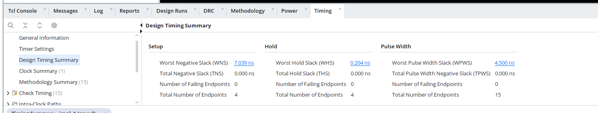
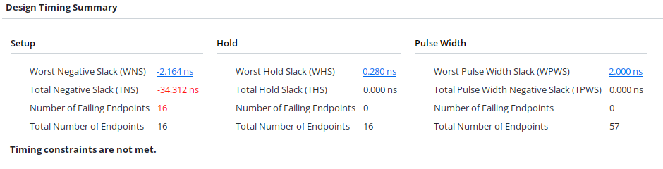
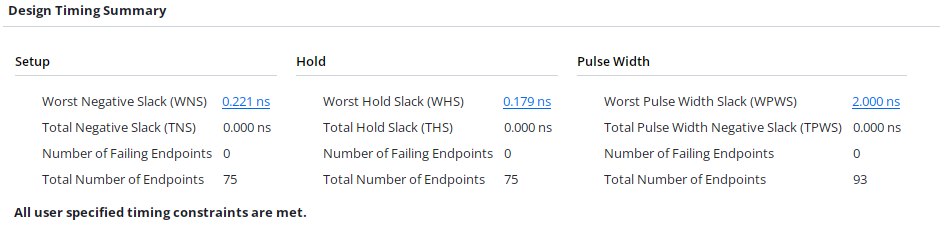

## ЧАСТИНА 1. КОНТРОЛЕР ЗАМКА (ЗАНЯТТЯ 6)

[LOCK_CONTROLLER](src/lock_controller.v)
[DEBOUNCE MODULE](src/debounce.v)
[TOP_MODULE](src/lock_controller_with_debounce.v)

[TESTBENCH](sim/tb_lock_controller.sv)

Тестбенч робився тільки для модуля замка, без врахування debounce, так як тестування інтеграції цих двох модулів вимагає значно більше часу

Результати симуляції

```text
launch_simulation: Time (s): cpu = 00:00:07 ; elapsed = 00:00:07 . Memory (MB): peak = 10979.488 ; gain = 0.000 ; free physical = 386 ; free virtual = 27707
Time resolution is 1 ps
Starting lock controller testbench...
Testing lock controller with input sequence: [ 5  3  7]
[PASS] Input sequence [ 5  3  7]
Testing lock controller with input sequence: [ 5 10  7]
[FAIL] Input sequence [ 5 10  7], unlocked_led = 0, expected = 1
Lock controller testbench completed.
```

## ЧАСТИНА 2. АНАЛІЗ TIMING SUMMARY REPORT (ЗАНЯТТЯ 7)

Значення таймінг репорту після компіляції [ALU](src/alu.v)


##  ЧАСТИНА 3. НЕКОНВЕЄРИЗОВАНИЙ І КОНВЕЄРИЗОВАНИЙ ВАРІАНТ (ЗАНЯТТЯ 7)

[STA constrain](constr/sta_investigation_constr.xdc)

Для [логічної функції без конвеєра](src/logic_func_plain.v)


Для [логічної функції з конвеєром](src/logic_func_pipe.v)


